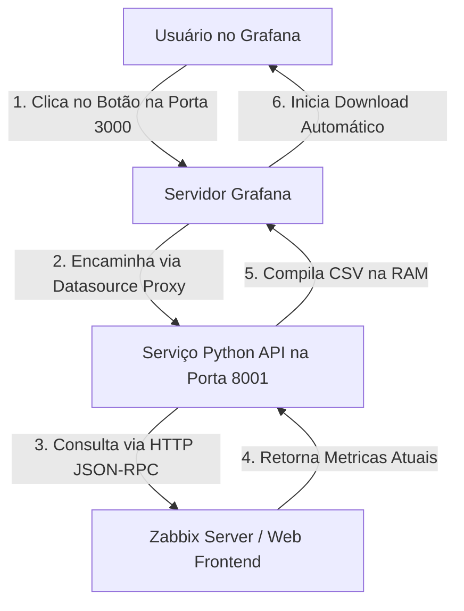

# Grafana-Zabbix-CSV-Download

Este repositório contém a solução completa para exportação de inventário ativo e métricas do Zabbix em formato `.csv` (e `.xlsx`) diretamente através de um botão de **1 clique** integrado nos Dashboards do Grafana, além de uma versão em script CLI para execução local.

A solução foi projetada especialmente para o **Zabbix 7.x** (e anteriores), rodando inteiramente na **memória RAM** do servidor (sem salvar arquivos temporários em disco), e utiliza o **Grafana Datasource Proxy** para burlar restrições de firewall de forma nativa pela porta `3000`.

---

## 🚀 Arquitetura e Fluxo de Dados



---

## 🛠️ Funcionalidades

*   **Exportação em 1 Clique:** Download imediato a partir de um botão estilizado inserido em qualquer dashboard do Grafana.
*   **Segurança e Privacidade:** Sem necessidade de credenciais de banco de dados (usa apenas o **API Token** do Zabbix).
*   **Zero Lixo no Disco:** Todo o arquivo CSV é processado na memória RAM do servidor (`io.StringIO`), eliminando o acúmulo de arquivos órfãos no disco.
*   **Classificação Inteligente:** Filtra e separa de forma automatizada hosts físicos/hypervisors, máquinas virtuais (VMs) e ativos de rede.
*   **Compatível com Zabbix 7.0+:** Tratamento para ignorar validação de certificados SSL (autoassinados) e restrições de cabeçalhos de autorização do Zabbix 7.

---

## 📂 Estrutura do Repositório

Aqui estão os arquivos de exportação disponíveis neste repositório:

### 📥 1. Integração de Botão no Grafana (FastAPI ➔ CSV)
*   [api_export_csv.py](api_export_csv.py): **[Botão]** API de exportação CSV para o Grafana (Cliente Safra - IP mantido oculto por segurança).
*   [api_export_csv_vega.py](api_export_csv_vega.py): **[Botão]** API de exportação CSV para o Grafana (Cliente Vega - IP `10.10.1.26`).

### 📊 2. Relatórios de Inventário CLI (Excel)
*   [export_hosts.py](export_hosts.py): **[EXPORT completo]** Script CLI para exportar inventário em planilha Excel (Cliente Safra - IP mantido oculto por segurança).
*   [export_hosts_vega.py](export_hosts_vega.py): **[EXPORT completo]** Script CLI para exportar inventário em planilha Excel (Cliente Vega - IP `10.10.1.26`).

---

## 1. ⚙️ Como Configurar o Microserviço no Servidor Linux

Siga estes passos no servidor onde seu **Grafana** (ou Zabbix) está hospedado:

### Passo 1.1: Criar a pasta do projeto
```bash
sudo mkdir -p /opt/zabbix_exporter
cd /opt/zabbix_exporter
```

### Passo 1.2: Criar o script da API (`api_export_csv.py`)
Crie o arquivo e cole o código contido na seção **Códigos** deste documento, configurando o IP do Zabbix e o seu Token nas variáveis indicadas.
```bash
sudo nano api_export_csv.py
```

### Passo 1.3: Instalar o gerenciador do Python (caso não possua)
```bash
# Para sistemas baseados em RedHat/RHEL/CentOS/Rocky Linux:
sudo dnf install python3-pip -y

# Para sistemas baseados em Ubuntu/Debian:
sudo apt update && sudo apt install python3-pip -y
```

### Passo 1.4: Configurar o Serviço de Segundo Plano (`systemd`)
Para garantir que o serviço permaneça sempre ativo, mesmo após reinicializações do servidor:

1. Crie o arquivo do serviço:
   ```bash
   sudo nano /etc/systemd/system/zabbix-csv-export.service
   ```
2. Cole o conteúdo de configuração:
   ```ini
   [Unit]
   Description=Zabbix CSV Export Service
   After=network.target

   [Service]
   Type=simple
   User=root
   WorkingDirectory=/opt/zabbix_exporter
   ExecStart=/usr/bin/python3 /opt/zabbix_exporter/api_export_csv.py
   Restart=always

   [Install]
   WantedBy=multi-user.target
   ```
3. Ative e inicie o serviço:
   ```bash
   sudo systemctl daemon-reload
   sudo systemctl enable zabbix-csv-export.service
   sudo systemctl start zabbix-csv-export.service
   ```
4. Monitore os logs do serviço para validar o funcionamento:
   ```bash
   sudo journalctl -u zabbix-csv-export.service -f --no-pager
   ```

---

## 2. 📊 Como Configurar o Botão no Painel do Grafana

Para que o botão funcione na porta padrão do Grafana (`3000`) sem esbarrar no firewall da rede local:

### Passo 2.1: Criar o Data Source Proxy
1. Vá em **Connections** -> **Data Sources** -> **Add data source**.
2. Selecione **InfluxDB** (usada apenas como encapsulador HTTP padrão).
3. Preencha os campos:
   * **Name:** `CSV_Proxy`
   * **URL:** `http://localhost:8001`
4. Clique em **Save & test** *(ignore qualquer mensagem de erro do teste, as configurações serão gravadas mesmo assim)*.

### Passo 2.2: Obter o UID do Data Source
Olhe para a barra de endereços do seu navegador enquanto edita o Data Source criado. A URL terminará com um código alfanumérico (o UID do datasource):
*   Exemplo: `.../connections/datasources/edit/ffq4o9ijoo4cgc`
*   Neste caso, o UID é: **`ffq4o9ijoo4cgc`**

### Passo 2.3: Adicionar o Painel com o Botão no Dashboard
1. No seu Dashboard do Grafana, adicione um novo painel do tipo **Text** (Texto).
2. Na barra de configurações do painel (menu à direita), troque a opção **Format** de **Markdown** para **HTML**.
3. No corpo do texto, cole o código HTML abaixo, inserindo o **UID** obtido no passo anterior:

```html
<div style="text-align: center; padding: 15px;">
  <a href="/api/datasources/proxy/uid/SEU_UID_AQUI/exportar_csv" target="_blank" 
     style="display: inline-block; background-color: #1A365D; color: white; padding: 12px 28px; font-weight: bold; border-radius: 6px; text-decoration: none; box-shadow: 0 4px 6px rgba(0,0,0,0.15); font-family: sans-serif; font-size: 14px; transition: background-color 0.2s;">
     📥 Baixar Base de Dados para CRM (.csv)
  </a>
</div>
```

4. Clique em **Apply** e **salve o Dashboard**. Arraste e posicione o painel do botão conforme desejado.

---

## 3. 💻 Como Executar Localmente via CLI (Fora do Grafana)

Caso você prefira gerar a planilha do Excel diretamente do seu próprio computador (fora do Grafana), você pode utilizar o script CLI `export_hosts.py`. Ele gerará um arquivo `.xlsx` completo, formatado e separado por abas na mesma pasta do script.

### Passo 3.1: Instalação e Configuração Local
1. Certifique-se de ter o **Python 3** instalado em sua máquina.
2. Abra o arquivo `export_hosts.py` em sua máquina.
3. Altere as configurações de autenticação com seus dados do Zabbix:
   ```python
   TOKEN = "SEU_TOKEN_AQUI"
   BASE_URL = "http://IP_DO_SEU_ZABBIX"
   ```

### Passo 3.2: Execução
Abra o terminal ou prompt de comando (cmd/PowerShell) na pasta do arquivo e execute:
```bash
python export_hosts.py
```

### 🔍 Como o Script Local Funciona:
1. **Auto-instalação de dependências:** O script verifica se a biblioteca `openpyxl` está instalada e, caso não esteja, realiza o download automático via `pip` de forma invisível.
2. **Consulta paralela na API:**
   * Busca a lista completa de hosts cadastrados e suas interfaces.
   * Consulta os proxies ativos para mapear onde cada host está sendo monitorado.
   * Mapeia os alertas e incidentes em tempo real no Zabbix.
   * Coleta métricas de CPU, uso de RAM, disco, uptime, SO e hardware de cada host.
3. **Tratamento de dados:**
   * **Uptime inteligente:** Detecta se o uptime coletado via SNMP está em centissegundos (padrão de alguns switches/hosts) e faz a conversão automática para exibir dias e horas reais.
   * **iDRAC / Físicos:** Classifica automaticamente servidores físicos e iDRACs Dell na aba de "Servidores Físicos".
4. **Geração do Excel Real com Design Premium:**
   * Monta a aba de **Dashboard (Resumo Geral)** com contadores visuais e divisão por tipo de monitoramento.
   * Aplica formatação de cores baseada na paleta oficial do Zabbix (Verde Escuro `#1E4A38` nos cabeçalhos e zebrado suave nas linhas).
   * Ajusta automaticamente a largura de todas as colunas para que nenhum dado seja cortado na visualização.
   * Salva o arquivo final como `ativos_zabbix.xlsx` na mesma pasta do script.

---

## 💻 Códigos dos Scripts

### 📂 `api_export_csv.py` (Versão de Servidor - API em RAM)

```python
import sys
import os
import io
import csv
import json
import urllib.request
import ssl

# Auto-instala as dependencias se nao existirem
for lib in ["fastapi", "uvicorn"]:
    try:
        __import__(lib)
    except ImportError:
        import subprocess
        print(f"Instalando {lib}...")
        subprocess.check_call([sys.executable, "-m", "pip", "install", lib])

from fastapi import FastAPI
from fastapi.responses import StreamingResponse
import uvicorn

app = FastAPI(title="Zabbix API CSV Export Service")

# CONFIGURAÇÕES DA API DO ZABBIX
TOKEN = "SEU_TOKEN_AQUI"
ZABBIX_API_URL = "http://IP_DO_SEU_ZABBIX/api_jsonrpc.php"

def call_zabbix_api(url, method, params, include_auth=True):
    payload = {
        "jsonrpc": "2.0",
        "method": method,
        "params": params,
        "id": 1
    }
    data = json.dumps(payload).encode('utf-8')
    headers = {
        "Content-Type": "application/json"
    }
    if include_auth:
        headers["Authorization"] = f"Bearer {TOKEN}"
        
    ctx = ssl._create_unverified_context()
    req = urllib.request.Request(url, data=data, headers=headers)
    try:
        with urllib.request.urlopen(req, timeout=20, context=ctx) as response:
            res = json.loads(response.read().decode('utf-8'))
            if 'result' in res:
                return res['result']
            else:
                print(f"[RESPOSTA API ERRO] Url: {url} - Resposta: {res}", file=sys.stderr)
                return None
    except Exception as e:
        print(f"[ERRO CONEXÃO API] Erro ao chamar {url} - {method}: {e}", file=sys.stderr)
        return None

@app.get("/exportar_csv")
def exportar_csv():
    hosts = call_zabbix_api(ZABBIX_API_URL, "host.get", {
        "output": ["hostid", "host", "name", "status", "proxy_hostid", "description"],
        "selectInterfaces": ["ip", "type", "port"],
        "selectHostGroups": ["name"],
        "selectParentTemplates": ["name"],
        "selectInventory": ["os", "hardware", "software", "serialno_a"]
    })
    
    if not hosts:
        return {"erro": "Falha ao conectar na API do Zabbix ou buscar hosts"}
        
    host_ids = [h['hostid'] for h in hosts]
    
    proxies_map = {}
    proxies = call_zabbix_api(ZABBIX_API_URL, "proxy.get", {"output": ["proxyid", "name"]}) or []
    for p in proxies:
        proxies_map[str(p['proxyid'])] = p['name']
        
    triggers_map = {}
    triggers = call_zabbix_api(ZABBIX_API_URL, "trigger.get", {
        "output": ["triggerid", "description", "priority"],
        "selectHosts": ["hostid"],
        "monitored": True,
        "only_true": True,
        "filter": {"value": 1}
    }) or []
    
    priorities = {"0": "Classif.", "1": "Info", "2": "Atencao", "3": "Media", "4": "Alta", "5": "Desastre"}
    for t in triggers:
        desc = t['description']
        priority_label = priorities.get(str(t['priority']), "Info")
        for h in t.get('hosts', []):
            hid = h['hostid']
            if hid not in triggers_map:
                triggers_map[hid] = []
            triggers_map[hid].append(f"[{priority_label.upper()}] {desc}")
            
    items = call_zabbix_api(ZABBIX_API_URL, "item.get", {
        "hostids": host_ids,
        "output": ["hostid", "name", "key_", "lastvalue", "units"],
        "search": {
            "key_": [
                "cpu.util", "cpu.usage", "hrProcessorLoad", 
                "memory.util", "memory.size[pused]", "memory.used", 
                "pused",
                "system.sw.os", "system.descr", "system.uname",
                "system.hw.model", "system.hw.device",
                "system.uptime", "sysUpTimeInstance", "hrSystemUptime"
            ]
        },
        "searchByAny": True,
        "monitored": True
    }) or []
    
    host_items_map = {}
    for item in items:
        hid = item['hostid']
        if hid not in host_items_map:
            host_items_map[hid] = []
        host_items_map[hid].append(item)
        
    csv_rows = []
    colunas = [
        "ID do Host", "Nome Tecnico", "Nome Visivel", "Endereco IP", 
        "Modelo de Monitoramento", "Status (Ativo/Inativo)", "Proxy de Monitoramento",
        "CPU Ult. Valor", "Memoria Ult. Valor", "Discos (Uso %)", "Uptime", "Alertas Ativos no Ativo",
        "Grupos", "Templates Vinculados", "Sistema Operacional (OS)", "Hardware", "Numero de Serie", "Descricao"
    ]
    
    for host in hosts:
        hostid = host.get('hostid', '')
        hostname = host.get('host', '')
        name = host.get('name', '')
        status = "Ativo" if host.get('status') == "0" else "Inativo"
        
        proxy_id = str(host.get('proxy_hostid', ''))
        proxy_name = proxies_map.get(proxy_id, "Direto (Zabbix Server)") if proxy_id != "0" and proxy_id != "" else "Direto (Zabbix Server)"
        
        ips = [iface.get('ip', '') for iface in host.get('interfaces', []) if iface.get('ip')]
        ip_str = ", ".join(list(set(ips))) if ips else ""
        
        types = []
        for iface in host.get('interfaces', []):
            iftype = iface.get('type')
            if iftype == '1': types.append("Agente Zabbix")
            elif iftype == '2': types.append("SNMP")
            elif iftype == '3': types.append("IPMI")
            elif iftype == '4': types.append("JMX")
        type_str = ", ".join(list(set(types))) if types else "API / Sem Agente"
        
        groups = [g.get('name', '') for g in host.get('hostgroups', [])]
        groups_str = ", ".join(groups)
        
        templates = [t.get('name', '') for t in host.get('parentTemplates', [])]
        templates_str = ", ".join(templates)
        
        alertas_list = triggers_map.get(hostid, [])
        active_alerts = " | ".join(alertas_list) if alertas_list else "Sem Incidentes"
        
        host_desc = host.get('description', '') or ""
        host_desc = host_desc.replace("\n", " ").replace("\r", " ").strip()
        
        inventory = host.get('inventory')
        os_inv = inventory.get('os', '') if isinstance(inventory, dict) else ""
        hw_inv = inventory.get('hardware', '') if isinstance(inventory, dict) else ""
        serial = inventory.get('serialno_a', '') if isinstance(inventory, dict) else ""
        
        host_items = host_items_map.get(hostid, [])
        cpu_val, mem_val, disks, os_fallback, hw_fallback, uptime_val = "N/A", "N/A", [], "", "", "N/A"
        
        for item in host_items:
            key = item.get('key_', '')
            val = item.get('lastvalue', '') or ""
            units = item.get('units', '') or ""
            item_name = item.get('name', '')
            
            if val == "": continue
            
            if key in ["system.sw.os", "system.descr", "system.uname"]:
                if not os_fallback or key == "system.sw.os":
                    os_fallback = val
            if key in ["system.hw.model", "system.hw.device"]:
                hw_fallback = val
                
            try:
                val_float = float(val)
                val_str = f"{val_float:.2f}{units}" if units else f"{val_float:.2f}"
            except ValueError:
                val_str = f"{val}{units}" if units else f"{val}"
                
            if ("cpu.util" in key or "cpu.usage" in key or "hrProcessorLoad" in key) and not ("hrProcessorLoad[" in key):
                if cpu_val == "N/A" or "system.cpu.util" in key or "vm.cpu.util" in key:
                    cpu_val = val_str
            elif "memory.util" in key or "memory.size[pused]" in key or "memory.used" in key:
                if mem_val == "N/A" or "util" in key or "pused" in key:
                    mem_val = val_str
            elif "pused" in key:
                disk_label = key.split("[")[-1].split(",")[0].replace("]", "") if "[" in key else item_name
                disk_entry = f"{disk_label}: {val_str}"
                if disk_entry not in disks:
                    disks.append(disk_entry)
            elif "system.uptime" in key or "sysUpTimeInstance" in key or "hrSystemUptime" in key:
                try:
                    seconds = float(val)
                    if "SNMP" in type_str and units != "s" and units != "uptime":
                        seconds = seconds / 100.0
                    days = int(seconds // 86400)
                    hours = int((seconds % 86400) // 3600)
                    minutes = int((seconds % 3600) // 60)
                    uptime_val = f"{days}d {hours}h {minutes}m" if days > 0 else (f"{hours}h {minutes}m" if hours > 0 else f"{minutes}m")
                except ValueError:
                    uptime_val = val
                    
        final_os = os_inv if os_inv else (os_fallback if os_fallback else "N/A")
        final_hw = hw_inv if hw_inv else (hw_fallback if hw_fallback else "N/A")
        final_os = final_os.replace("\n", " ").replace("\r", " ").strip()
        final_hw = final_hw.replace("\n", " ").replace("\r", " ").strip()
        disks_str = " | ".join(disks) if disks else "N/A"
        
        row_data = [
            hostid, hostname, name, ip_str, type_str, status, proxy_name,
            cpu_val, mem_val, disks_str, uptime_val, active_alerts, groups_str, templates_str,
            final_os, final_hw, serial, host_desc
        ]
        csv_rows.append(row_data)

    output = io.StringIO()
    output.write('\ufeff')
    writer = csv.writer(output, delimiter=';', lineterminator='\n')
    writer.writerow(colunas)
    writer.writerows(csv_rows)
    
    csv_data = output.getvalue().encode('utf-8-sig')
    output.close()

    headers = {'Content-Disposition': 'attachment; filename="relatorio_zabbix.csv"'}
    return StreamingResponse(io.BytesIO(csv_data), media_type="text/csv", headers=headers)

if __name__ == "__main__":
    uvicorn.run(app, host="0.0.0.0", port=8001)
```
